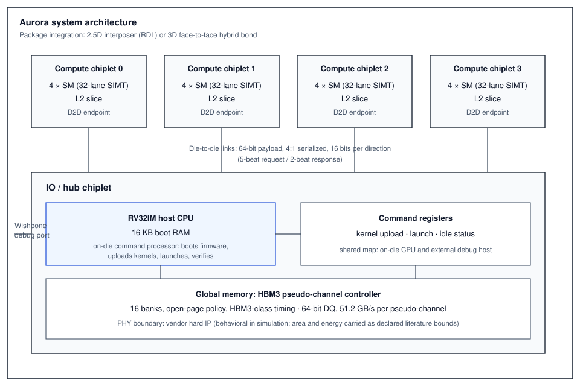

<div align="center">

# AURORA

**A chiplet-based SIMT GPU SoC, developed end-to-end in the open: RTL, firmware, synthesis, and 2.5D/3D physical design.**

[](LICENSE)
[](rtl/)
[-purple.svg)](https://asap.asu.edu/)
[](#synthesis-results-asap7-cadence-genus)
[](rtl/aurora_pkg.vh)
[](rtl/riscv_core.v)

[Architecture](#architecture) ·
[ISA](#instruction-set) ·
[Results](#synthesis-results-asap7-cadence-genus) ·
[Interconnect study](#die-to-die-interconnect-field-solved) ·
[Comparison](#comparison-with-production-gpus) ·
[Build and run](#build-and-run)

</div>

---

Aurora is a complete GPU system-on-chip partitioned into chiplets: four
compute chiplets (four streaming multiprocessors each) around an IO hub die
carrying an on-die RV32IM host processor. The system boots from its own
firmware, uploads kernels, launches them, and verifies results with no
external host. Package integration is 2.5D (interposer RDL), with a
field-solved 3D face-to-face hybrid-bond option.

The default configuration provides **512 SIMT lanes and 4,096 resident
threads**. Every scale parameter — chiplet count, SMs per chiplet, warps,
lanes — is defined in a single header ([`rtl/aurora_pkg.vh`](rtl/aurora_pkg.vh));
larger configurations are a parameter change, not an RTL rewrite.

The entire project is reproducible on open technology: the ASAP7 predictive
PDK, plain Verilog-2001, and a single synthesis script.

## Verified results at a glance

| Category | Result | Evidence |
|---|---|---|
| Sustained compute | **995.8 GOPS — 97.2% of theoretical peak** (verified arithmetic, 16 SMs) | [`docs/BENCHMARKS.md`](docs/BENCHMARKS.md) |
| On-chip bandwidth | **≈ 1.96 TB/s** shared-memory aggregate | benchmarks |
| Kernel launch overhead | 26 cycles | benchmarks |
| Gate-level verification | **All synthesized netlists PASS** — hub (firmware bring-up over the debug port), SM core, RV32 host | [`docs/GLS_REPORT.md`](docs/GLS_REPORT.md) |
| SM core v2 synthesis | 1.0 GHz timing met · 0.229 mm² · −37% vs v1 | this page |
| IO hub v3 die (place and route) | **1 GHz closed post-route** (WNS +0.118 ns) · 0.228 mm² die | this page |
| Die-to-die channel energy | **2.69 fJ/bit** (3D hybrid bond, field-solved) | Q3D study below |
| Host bring-up | RV32 firmware boots, uploads, launches, verifies — zero external bus activity | GLS report |

## Architecture

### System

<div align="center">

</div>

**Memory system.** Each compute chiplet carries an L2 slice (SM round-robin
arbitration, local scratch, remote window forwarded over the die-to-die
link). The hub aggregates the four D2D endpoints and the host window into an
HBM3 pseudo-channel controller ([`rtl/hbm_ctrl.v`](rtl/hbm_ctrl.v)):
synthesizable bank-state logic with 16 word-interleaved banks, per-bank
open-row tracking, an open-page policy, and HBM3-class timing parameters. The
PHY ([`rtl/hbm3_phy.v`](rtl/hbm3_phy.v)) is treated as vendor hard IP: it is
behavioral in simulation and interface-only in synthesis, with area and
energy carried as declared literature bounds rather than synthesized
approximations. One pseudo-channel (64-bit DQ at 6.4 Gb/s, 51.2 GB/s) matches
the present core's serialized demand; scaling to a full stack is an explicit
roadmap item gated on L2 coalescing.

The design is architecturally 32-bit end-to-end (GPU lane addresses and host
CPU alike), bounding the addressable space at 4 GB by construction.

### SM core (v2: SRAM register file)

```
                 ┌────────────────────────────────────────────────────┐
                 │                     sm_core                        │
   8 warps       │  ┌───────────┐   ┌─────────┐   ┌───────────────┐  │
   round-robin ─▶│  │  ISSUE    ├──▶│   EX    ├──▶│      WB       │  │
   per-warp PC   │  │ imem read │   │ 32-lane │   │ lane-merge    │  │
   + active mask │  │ RF sync   │   │ SIMD ALU│   │ (mask?new:old)│  │
                 │  │ read      │   │ MAD/SHF │   │ RF write      │  │
                 │  └─────┬─────┘   └────┬────┘   └───────┬───────┘  │
                 │        │              │                │          │
                 │  ┌─────┴──────────────┴────────────────┴───────┐  │
                 │  │ register file: 12 × 1R1W SRAM (272×256)     │  │
                 │  │ = 3 read copies (ra / rb / rd-old) × 4 banks│  │
                 │  │ issue-stage synchronous reads; 3-deep       │  │
                 │  │ same-warp interlock                         │  │
                 │  └─────────────────────────────────────────────┘  │
                 │  4 KB shared memory · LSU · block barrier         │
                 └────────────────────────────────────────────────────┘
```

- Round-robin scheduling over eight resident warps with per-warp program
  counter and active mask. `SETP` folds per-lane predicates into the mask;
  `BRA` is a uniform any-active branch; `BAR` is an SM-wide barrier.
- 32 × 32-bit registers per thread; 4 KB shared memory per SM.
- The v1 flop-based register file accounted for 46% of SM area (1.49M
  instances). v2 replaces it with banked 1R1W SRAM macros, a write-back
  lane-merge in place of per-bit write masking, and a three-deep same-warp
  interlock (which also closed a latent v1 read-after-write hazard). The
  flop-based file is retained under [`rtl/legacy/`](rtl/legacy/) for FPGA
  targets and macro-less flows.

### Host processor

[`rtl/riscv_core.v`](rtl/riscv_core.v) implements RV32I with the M-extension
multiply set as a multi-cycle core. A command processor is latency- rather
than throughput-critical; the multi-cycle organization keeps the core small
(9,774 cells, 0.0011 mm²) and closes 1 GHz without effort. Firmware
([`fw/cmd_proc.S`](fw/cmd_proc.S), assembled by the self-contained
[`tools/rvasm.py`](tools/rvasm.py)) performs the full driver sequence:
initialize memory, upload the kernel to all 16 SMs, launch, poll idle, verify
results on-die, and report through a result register. Verified end-to-end in
simulation with no external bus activity.

| CPU address | Region |
|---|---|
| `0x0000_0000` | 16 KB boot RAM (code and data) |
| `0x1000_0000` | global memory window |
| `0x4000_0000` | SM instruction upload (broadcast) |
| `0x8000_0000` | launch / idle status |
| `0xF000_0000` | result register |

The external Wishbone interface is retained as a bring-up and debug port
(firmware load at `0xC000_0000`; the complete v1 host register map is
preserved). A `cpu_en` strap selects self-boot or external-host operation.

**On RV32 rather than RV64.** Nothing in the machine is 64-bit: command
registers, kernel words, lane data, and lane addresses are all 32-bit, so the
SoC addresses at most 4 GB by construction. A 64-bit host would double the
datapath and register file of a core whose role is register access and status
polling, with no gain in reach until the GPU ISA itself widens. When a larger
address space is required, RV64 and a 64-bit load/store format are one
coherent, planned upgrade.

## Instruction set

20 operations, 32-bit encoding:
`[31:27] opcode | [26:22] rd | [21:17] ra | [16:12] rb | [11:0] simm12`

| Class | Operations |
|---|---|
| Arithmetic and logic | `ADD SUB MUL MAD AND OR XOR SHL SHR MOVI` |
| Memory | `LDG STG` (global, per-lane addressing) · `LDS STS` (shared) |
| Control | `SETP` (predicate to mask) · `BRA` (uniform) · `BAR` · `EXIT` |
| Special | `TID` (global thread ID) · `NOP` |

## Synthesis results (ASAP7, Cadence Genus)

### SM core: v1 (flop register file) versus v2 (SRAM register file), 1 GHz target, TT corner

| Metric | v1 | v2 | Change |
|---|---|---|---|
| Leaf cells | 3,637,886 | 2,102,408 | −42% |
| Area | 0.365 mm² | 0.229 mm² (incl. 12 SRAM macros, 0.035 mm²) | −37% |
| Worst slack at 1 GHz | −65 ps (≈ 940 MHz) | **0 ps — timing met at 1.0 GHz** | closed |
| Power at 1 GHz | 0.882 W (≈ 50% in the register file) | 0.229 W ¹ | −74% ¹ |

¹ v2 macro power derives from a generated memory-compiler liberty with a
simplified power model; the logic contribution is reliable, the macro
contribution approximate. The removed 1.49M-instance flop register file
dominates the difference in either reading.

### All blocks

| Block | Cells | Area | Timing | Power |
|---|---|---|---|---|
| SM core (1 SM, v1) | 3,637,886 | 0.365 mm² | −65 ps (≈ 940 MHz) | 0.882 W |
| — register file | 1,486,744 | 0.168 mm² (46% of SM) | — | — |
| — SIMD ALU | 129,145 | 0.010 mm² | — | — |
| L2 slice and glue | 366,350 | 0.059 mm² | +82 ps, met | 25.5 mW |
| IO hub, v1 (external host only) | 2,996,200 | 0.477 mm² | met (0 ps worst) | — |
| **IO hub, v3 (RV32 CPU + HBM controller)** | **771,146** | **0.120 mm²** | **met (0 ps at 1 GHz)** | 0.360 W ² |

² Dominated (93% internal) by the boot RAM implemented in flops; an SRAM
boot macro is a planned change.

The v3 hub is four times smaller than v1: replacing the on-die scratch bank
with the HBM PHY boundary recovered far more area than the RV32 subsystem
(9,774 cells) and HBM controller (869 cells) consumed.

### Physical design (Cadence Innovus, ASAP7)

| Die | Result |
|---|---|
| IO hub v3 | **Complete: 477.8 × 477.6 µm (0.228 mm²), post-route WNS +0.118 ns setup / +0.246 ns hold, TNS 0.000 — 1 GHz closed.** GDS, LEF abstract, SPEF, and netlist delivered. |
| IO hub v1 | Complete: 941 × 941 µm, post-route WNS −0.126 ns (≈ 888 MHz), hold clean. |
| SM core v2 | In progress (SRAM macros placed; routing). |
| SM core v1 | Discontinued: did not close within 48 h against the flop register file; superseded by v2. |

## Die-to-die interconnect (field-solved)

Capacitance matrices extracted with Ansys Q3D; raw data in
[`docs/ansys/`](docs/ansys/). Energy is ½CV² at 0.7 V, wire/channel only
(no PHY circuitry):

| Link | C_self | C_mutual | Crosstalk | Energy per bit |
|---|---|---|---|---|
| 3D face-to-face hybrid bond (5 µm pad, 10 µm pitch) | 10.96 fF | 0.0001 fF | 0.001% | **2.69 fJ** |
| 2.5D RDL, 200 µm | 15.54 fF | 4.01 fF | 25.8% | 3.81 fJ |
| 2.5D RDL, 500 µm | 38.50 fF | 9.98 fF | 25.9% | 9.43 fJ |
| 2.5D RDL, 1 mm | 75.92 fF | 18.76 fF | 24.7% | 18.6 fJ |
| 2.5D RDL, 2 mm | 149.11 fF | 36.25 fF | 24.3% | 36.5 fJ |

At practical reaches, the 3D face-to-face option carries roughly 7–14× lower
channel energy than same-package 2.5D routing, with crosstalk four orders of
magnitude lower — quantitative support for vertical integration in
die-to-die interconnect.

## Comparison with NVIDIA and AMD

Full analysis, including all caveats, in
[`docs/FLAGSHIP_COMPARISON.md`](docs/FLAGSHIP_COMPARISON.md).

**Scale context (absolute numbers, honesty first).** Aurora is an academic-
scale implementation — roughly 2,500× smaller than a production flagship in
absolute silicon. The absolute row exists to keep the normalized comparison
honest, not to compete with it:

| | Aurora (this work) | NVIDIA H100 SXM | NVIDIA B200 | AMD MI300X |
|---|---|---|---|---|
| Process | ASAP7 (7 nm predictive, academic) | TSMC 4N | TSMC 4NP (dual die) | 5 nm + 6 nm chiplets |
| Transistors | ≈ 0.3 B (est.) | 80 B | 208 B | 153 B |
| Logic area | 6.6 mm² (v1) / ≈ 4.1 mm² (v2 basis) | 814 mm² | ≈ 2 × 800 mm² | 1017 mm² |
| Parallel lanes | 512 (4,096 threads) | 16,896 FP32 cores | ≈ 2× H100 class | 19,456 lanes |
| Clock | 1.0 GHz (v2, closed) | ≈ 1.98 GHz boost | ≈ 1.8+ GHz | 2.1 GHz |
| Power | ≈ 14 W (synthesis est., v1) | 700 W | 1,000 W | 750 W |
| Peak throughput | 0.48 TOPS int32 (0.96 counting MAD as 2) | 67 TFLOPS FP32 | 9,000 TFLOPS dense FP8 | 163 TFLOPS FP32 |
| Integration | 2.5D interposer + 3D F2F option | monolithic | 2-die NV-HBI | 2.5D + 3D hybrid |

**Normalized efficiency (the meaningful comparison).**

| Metric | Aurora v1 | Aurora v2 basis ¹ | H100 (FP32) | MI300X (FP32) |
|---|---|---|---|---|
| Throughput / area | 73 GOPS/mm² (146 w/ MAD-as-2) | ≈ 117 (234) GOPS/mm² | 82 GFLOPS/mm² | ≈ 160 GFLOPS/mm² |
| Throughput / power | 34 GOPS/W (69 w/ MAD-as-2) | — ² | 96 GFLOPS/W | ≈ 217 GFLOPS/W |

At synthesis stage, on a predictive PDK, a hand-written 20-op SIMT machine
lands **within roughly 1–2× of H100-class area efficiency** (and, on the v2
area basis, at or above it), and within ≈ 0.7–2× of MI300X area efficiency —
with 97.2% of its own peak *measured*, not asserted. Power efficiency trails
the flagships by ≈ 1.4–6×, which is the expected cost of no clock gating, no
DVFS, and default-activity power estimation.

**Interconnect, where the comparison favors this work**: Aurora's 3D
face-to-face die-to-die channel is field-solved at **2.69 fJ/bit** —
one to two orders of magnitude below full-PHY figures published for UCIe
advanced package (≈ 250–500 fJ/bit) and NVLink-C2C class links
(≈ 1,300 fJ/bit), with the wire-vs-full-PHY caveat stated in the full
analysis.

Declared caveats: predictive PDK; post-synthesis power; 32-bit integer
operations compared against IEEE FP32; no HBM subsystem in Aurora's area and
power budget; flagship figures are vendor-published peaks.

¹ v2 area basis: the measured −37% SM area and −75% hub area applied to the
v1 rollup (≈ 4.1 mm² total); throughput unchanged. Synthesis areas, not
routed die areas.
² v2 macro power comes from a simplified memory-compiler model; a
power-efficiency claim on that basis would not be honest. v1 power figures
stand until routed v2 power is extracted.

## Build and run

```bash
# Self-boot SoC test: RV32 firmware drives the GPU with no external host
python3 tools/rvasm.py fw/cmd_proc.S fw/cmd_proc.hex
xrun -sv -incdir rtl -define AURORA_SIM tb/tb_aurora_riscv.v rtl/*.v rtl/legacy/regfile_flops.v
# expected: FW_RESULT 600d0000 / AURORA_RISCV_PASS

# External-host test (Wishbone testbench, same register map)
xrun -sv -incdir rtl -define AURORA_SIM tb/tb_aurora_smoke.v rtl/*.v rtl/legacy/regfile_flops.v
# expected: AURORA_SMOKE_PASS

# Synthesis (Cadence Genus with ASAP7 CCS libraries; set the two paths at the top)
genus -batch -files flow/genus_aurora_asap7.tcl
```

`AURORA_SIM` selects the behavioral SRAM model; without it the macro is a
synthesis black box. The self-boot test uploads a vector-add kernel over the
full SM → L2 → D2D → hub path and verifies results on-die.

## Repository

```
rtl/
├── aurora_pkg.vh              scale parameters and ISA encoding
├── riscv_core.v               RV32IM host CPU (multi-cycle)
├── hbm_ctrl.v                 HBM3 pseudo-channel controller
├── hbm3_phy.v                 PHY hard-IP boundary (behavioral in simulation)
├── sm_core.v                  SIMT streaming multiprocessor
├── simd_alu.v                 32-lane integer ALU
├── warp_sched.v               round-robin warp scheduler
├── regfile_sram.v             v2 register file (3 read copies × 4 banks)
├── sram_1r1w_272_256_asap7.v  SRAM macro model / black box
├── l2_slice.v                 per-chiplet L2 and request arbitration
├── d2d_link.v                 serialized die-to-die link
├── compute_chiplet.v          4 × SM + L2 + D2D endpoint
├── io_chiplet.v               hub: host CPU, command registers, memory
├── aurora_top_2p5d.v          full system assembly
└── legacy/regfile_flops.v     v1 register file (FPGA-friendly)
tb/                            self-checking testbenches (self-boot, external host, benchmarks)
fw/cmd_proc.S                  command-processor firmware
tools/rvasm.py                 self-contained RV32 assembler
flow/genus_aurora_asap7.tcl    synthesis recipe
docs/FLAGSHIP_COMPARISON.md    normalized comparison and caveats
docs/ansys/                    Q3D capacitance matrices
```

## Status and roadmap

Complete:
- RTL with self-checking verification (self-boot and external-host modes)
- Synthesis of all blocks on ASAP7 (CCS libraries)
- v2 SM core: 1 GHz closed, −37% area
- On-die RV32IM host processor with verified firmware bring-up
- HBM3 pseudo-channel memory controller; verified in both test modes
- Ansys Q3D die-to-die interconnect study (2.5D and 3D)
- IO hub die: placed, routed, timing closed at 1 GHz

Complete (verification):
- **Gate-level simulation of every synthesized netlist: hub (firmware
  bring-up through the debug port), SM core v2, and RV32 core — all PASS**
  ([`docs/GLS_REPORT.md`](docs/GLS_REPORT.md)); three RTL defects found and
  fixed in the process

In progress:
- SM core v2 die (routing)

Measured ([`docs/BENCHMARKS.md`](docs/BENCHMARKS.md)):
- Compute: **995.8 GOPS sustained — 97.2% of theoretical peak** (verified
  arithmetic, all 16 SMs)
- On-chip shared memory: **~1.96 TB/s aggregate**
- Global memory: 0.09 GB/s — bounded by three deliberate v1 simplifications
  (serializing LSU, single-outstanding controller, execute gated on LSU),
  each a defined roadmap item

Planned:
- Compute-chiplet assembly and full 4+1-chiplet GDS
- L2 memory coalescing; multi-pseudo-channel HBM; non-blocking LSU
- SRAM boot ROM; interrupts and CSRs; multi-kernel scheduling firmware
- FP32 datapath option; RV64 with 64-bit load/store when the address space requires it

## License

[MIT](LICENSE) © 2026 Fidel Makatia
